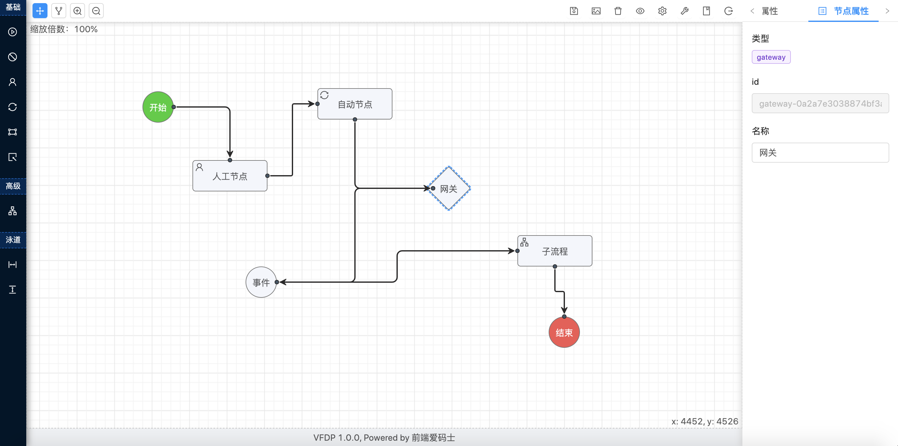

#### 在线演示

[点击预览](https://a63149300.github.io/vue-flow-design-plus)

#### 介绍

- VUE FLOW DESIGN PLUS 流程设计器，基于 Vue + Ant Design Vue + JSPlumb，该组件目的是为了使用在 Vue 项目中，它前身是[VFD 流程设计器](https://github.com/ZFSNYJ/VFD)。
- Vue 版本以全新的技术栈重构了代码，并在原版基础上实现了更好的操作方式，新版会作为优先版本持续迭代。

#### Vue3 版本开源

- VUE3 FLOW DESIGN 流程设计器，基于 Vue3 + TypeScript + Vite + Ant Design Vue 3 + JSPlumb。[vue3-flow-design](https://gitee.com/zhangyeping/vue3-flow-design)。

#### 优化内容

- 解决之前 VFD 遗留的 BUG
- 将 jquery-ui 换成原生写法
- 将 jquery 换成原生写法
- 修改 that 为 this 写法，改写箭头函数
- 注解添加
- 持续优化
- ...

#### 操作命令

- 安装项目 node_modules 包：yarn

- 启动项目：yarn start

- 构建项目 dist 文件夹资源：npm run build

#### 效果演示

- 最新界面效果
  

- 基础面板

  

- 拖拽节点到绘图区连线

  

- 拖拽对齐或使用自动对齐

  

- 显示/隐藏网格

  

- 设置节点和连线的属性

  

- 单节点、多节点移动(按住 CTRL 键)

  

- 改变节点对齐的排序顺序(按住 Ctrl 键一个一个单击选中要对齐的节点，单击的顺序就是对齐的排列顺序)

  

- 清空画布，重新绘制

  

- 保存流程图(会生成一段 json 数据，后台可以保存这段数据，为了便于调试，生成的 json 数据可以通过快捷键 CTRL+ALT+T 打开的测试窗口看到。同时也可以从该窗口载入其他的符合流程图的 json 数据)

  

- 保存流程图为图片保存到本地

  

- 画布拖拽、缩放

  

- 通过设置页面(CTRL+ALT+S)可以设置相关参数

  

- 快捷键说明

  

- 。。。。。。

```

```
